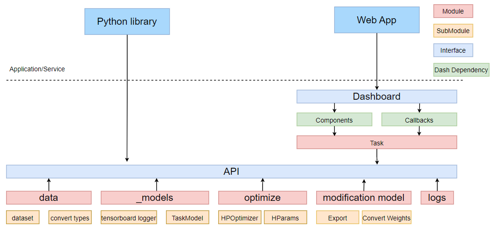

Architecture
=============

|
|

The api is based on 5 modules:

    - data: contains an internal representation of the dataset, classes for converting datasets, fiftyone dataset

    - _models: torch model, its hyperparams, functions for training

    - optimize: set of hyperparams, optuna optimizer

    - modification model: export and conversion of weights

    - logs: python logging

The Dash library was used for dashboard. It is based on components and callbacks on these component elements.